# SMD-Nets: Stereo Mixture Density Networks

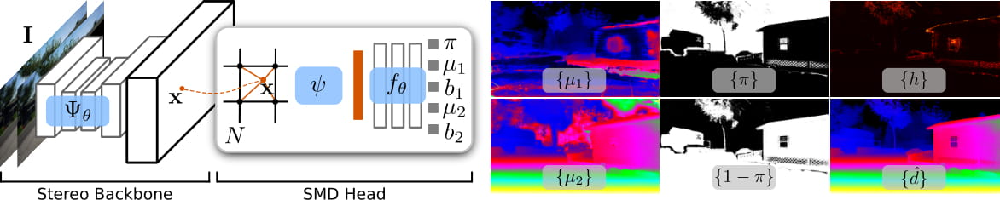


This repository contains a Pytorch implementation of "SMD-Nets: Stereo Mixture Density Networks" (CVPR 2021) by [Fabio Tosi](https://vision.disi.unibo.it/~ftosi/), [Yiyi Liao](https://www.is.mpg.de/person/yliao), [Carolin Schmitt](https://avg.is.tuebingen.mpg.de/person/cschmitt) and [Andreas Geiger](http://www.cvlibs.net/)

**Contributions:** 

* A novel learning framework for stereo matching that exploits compactly parameterized bimodal mixture densities as output representation and can be trained using a simple likelihood-based loss function. Our simple formulation lets us avoid bleeding artifacts at depth discontinuities and provides a measure for aleatoric uncertainty.

* A continuous function formulation aimed at estimating disparities at arbitrary spatial resolution with constant memory footprint.

* A new large-scale synthetic binocular stereo dataset with ground truth disparities at 3840×2160 resolution, comprising photo-realistic renderings of indoor and outdoor environments.

For more details, please check:

[[Paper]](http://www.cvlibs.net/publications/Tosi2021CVPR.pdf)   [[Supplementary]](http://www.cvlibs.net/publications/Tosi2021CVPR_supplementary.pdf)  [[Poster]](www.cvlibs.net/publications/Tosi2021CVPR_poster.pdf) [[Video]](https://www.youtube.com/watch?v=tvVGuUSe2n8&t=148s)   [[Blog]](https://autonomousvision.github.io/smdnets/)   

If you find this code useful in your research, please cite:

```shell
@INPROCEEDINGS{Tosi2021CVPR,
  author = {Fabio Tosi and Yiyi Liao and Carolin Schmitt and Andreas Geiger},
  title = {SMD-Nets: Stereo Mixture Density Networks},
  booktitle = {Conference on Computer Vision and Pattern Recognition (CVPR)},
  year = {2021}
} 
```

## Requirements
This code was tested with Python 3.8, Pytotch 1.8, CUDA 11.2 and Ubuntu 20.04. <br>All our experiments were performed on a single NVIDIA Titan V100 GPU.<br>Requirements can be installed using the following script:
```shell
pip install -r requirements
```

## Datasets

We create our synthetic dataset, UnrealStereo4K, using the popular game engine [Unreal Engine](https://www.unrealengine.com/en-US/) combined with the open-source plugin [UnrealCV](https://unrealcv.org/).

### UnrealStereo4K 
Our photo-realistic synthetic passive binocular UnrealStereo4K dataset consists of images of 8 static scenes, including indoor and outdoor environments. We rendered stereo pairs at **3840×2160** resolution for each scene with pixel-accurate **ground truth disparity maps** (aligned with both the left and the right images!) and **ground truth poses**. 

You can automatically download the entire synthetic binocular stereo dataset using the ```download_data.sh``` script in the ```scripts``` folder. In alternative, you can download each scene individually:

[UnrealStereo4K_00000.zip [74 GB]](https://s3.eu-central-1.amazonaws.com/avg-projects/smd_nets/UnrealStereo4K_00000.zip)<br>
[UnrealStereo4K_00001.zip [73 GB]](https://s3.eu-central-1.amazonaws.com/avg-projects/smd_nets/UnrealStereo4K_00001.zip)<br>
[UnrealStereo4K_00002.zip [74 GB]](https://s3.eu-central-1.amazonaws.com/avg-projects/smd_nets/UnrealStereo4K_00002.zip)<br>
[UnrealStereo4K_00003.zip [73 GB]](https://s3.eu-central-1.amazonaws.com/avg-projects/smd_nets/UnrealStereo4K_00003.zip)<br>
[UnrealStereo4K_00004.zip [72 GB]](https://s3.eu-central-1.amazonaws.com/avg-projects/smd_nets/UnrealStereo4K_00004.zip)<br>
[UnrealStereo4K_00005.zip [74 GB]](https://s3.eu-central-1.amazonaws.com/avg-projects/smd_nets/UnrealStereo4K_00005.zip)<br>
[UnrealStereo4K_00006.zip [67 GB]](https://s3.eu-central-1.amazonaws.com/avg-projects/smd_nets/UnrealStereo4K_00006.zip)<br>
[UnrealStereo4K_00007.zip [76 GB]](https://s3.eu-central-1.amazonaws.com/avg-projects/smd_nets/UnrealStereo4K_00007.zip)<br>
[UnrealStereo4K_00008.zip [16 GB]](https://s3.eu-central-1.amazonaws.com/avg-projects/smd_nets/UnrealStereo4K_00008.zip) - It contains 200 stereo pairs only, used as out-of-domain test set


**Warning!**: All the RGB images are PNG files at 8 MPx. This notably slows down the training process due to the expensive dataloading operation. Thus, we suggest compressing the images to raw binary files to speed up the process and trainings (<u>Pay attention to edit the filenames accordingly</u>). You can use the following code to convert (**offline**) the stereo images (Image0 and Image1 folders) to a ```raw``` format:

```shell
img_path=/path/to/the/image
out = open(img_path.replace("png", "raw"), 'wb') 
img = cv2.imread(img_path, -1)
img = cv2.cvtColor(img, cv2.COLOR_RGBA2RGB)
img.tofile(out)
out.close()
```


## Training

All training and testing scripts are provided in the ```scripts``` folder. <br>
As an example, use the following command to train SMD-Nets on our UnrealStereo4K dataset. 

```shell
python apps/train.py --dataroot $dataroot \
                     --checkpoints_path $checkpoints_path \
                     --training_file $training_file \
                     --testing_file $testing_file \
                     --results_path $results_path \
                     --mode $mode \
                     --name $name \
                     --batch_size $batch_size \
                     --num_epoch $num_epoch \
                     --learning_rate $learning_rate \
                     --gamma $gamma \
                     --crop_height $crop_height \
                     --crop_width $crop_width \
                     --num_sample_inout $num_sample_inout \
                     --aspect_ratio $aspect_ratio \
                     --sampling $sampling \
                     --output_representation $output_representation \
                     --backbone $backbone
```
For a detailed description of training options, please take a look at ```lib/options.py```<br>

In order to monitor and visualize the training process, you can start a tensorboard session with:

```shell
tensorboard --logdir checkpoints
```

## Evaluation

Use the following command to evaluate the trained SMD-Nets on our UnrealStereo4K dataset.

```shell
python apps/test.py --dataroot $dataroot \
                    --testing_file $testing_file \
                    --results_path $results_path \
                    --mode $mode \
                    --batch_size 1 \
                    --superes_factor $superes_factor \
                    --aspect_ratio $aspect_ratio \
                    --output_representation $output_representation \
                    --load_checkpoint_path $checkpoints_path \
                    --backbone $backbone 
```

**Warning!** The soft edge error (SEE) on the KITTI dataset requires instance segmentation maps from the KITTI 2015 dataset.


<u>**Stereo Ultra High-Resolution**</u>: if you want to estimate a disparity map at arbitrary spatial resolution given a low resolution stereo pair at testing time, just use a different value for the ```superres_factor``` parameter (e.g. 2,4,8..32!). Below, a comparison of our model using the PSMNet backbone at 128Mpx resolution (top) and the original PSMNet at 0.5Mpx resolution (bottom), both taking stereo pairs at 0.5Mpx resolution as input. 

<p align="center">
  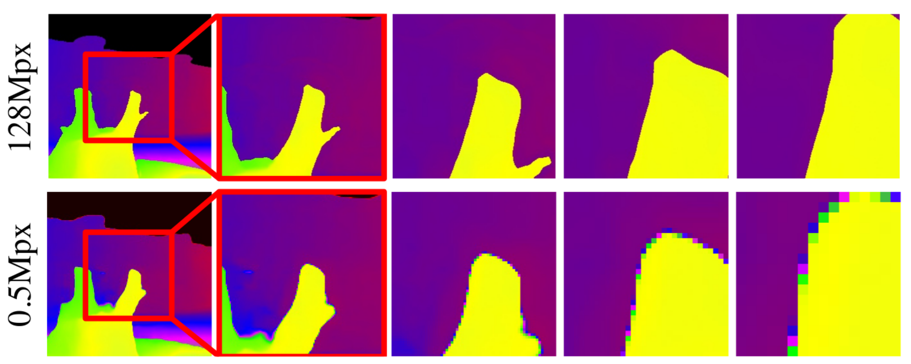
</p>


## Pretrained models

You can download pre-trained models on our UnrealStereo4K dataset from the following links:

* [PSMNet + SMD Head](https://drive.google.com/file/d/1lDguePc4yVnVjwxxRhez3wgLhzfOJkyP/view?usp=sharing)

* [PSMNet + SMD Head](https://drive.google.com/file/d/1PHICTx08m3kIxNQHmIrgoUFfrSyLbTiQ/view?usp=sharing) (fine-tuned on KITTI)

* [HSMNet + SMD Head](https://drive.google.com/file/d/1NG7yX8YGDGemKm2M8TNceSxlkMhEvOBU/view?usp=sharing)


## Qualitative results

**Disparity Visualization.** Some qualitative results of the proposed SMD-Nets using PSMNet as stereo backbone. From left to right, the input image from the UnrealStereo4K test set, the predicted disparity and the corresponding error map. Please zoom-in to better perceive details near depth boundaries.

<p float="left">
  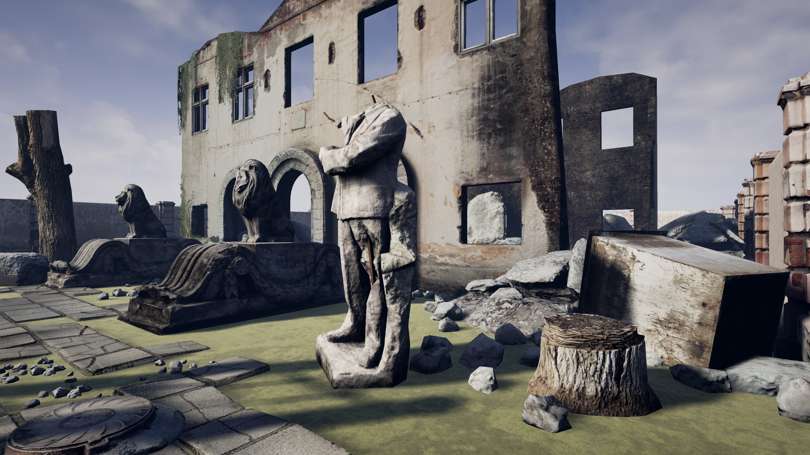
  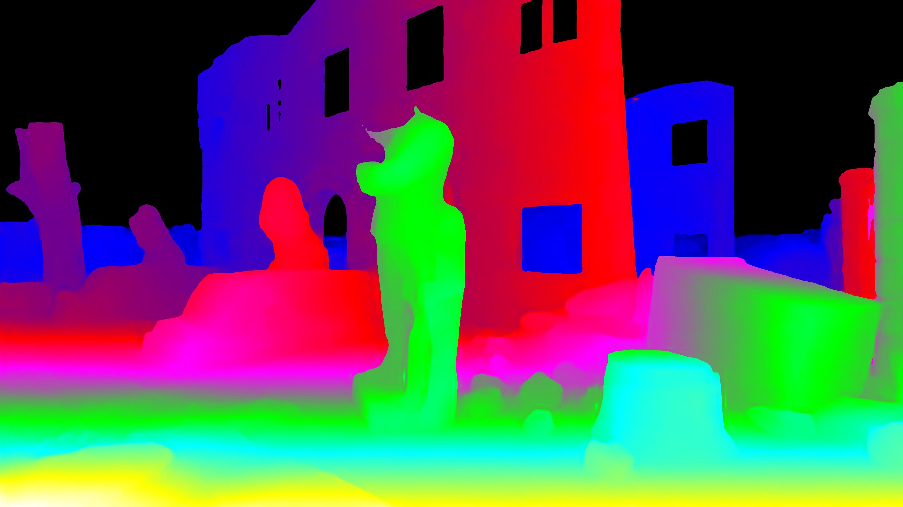 
  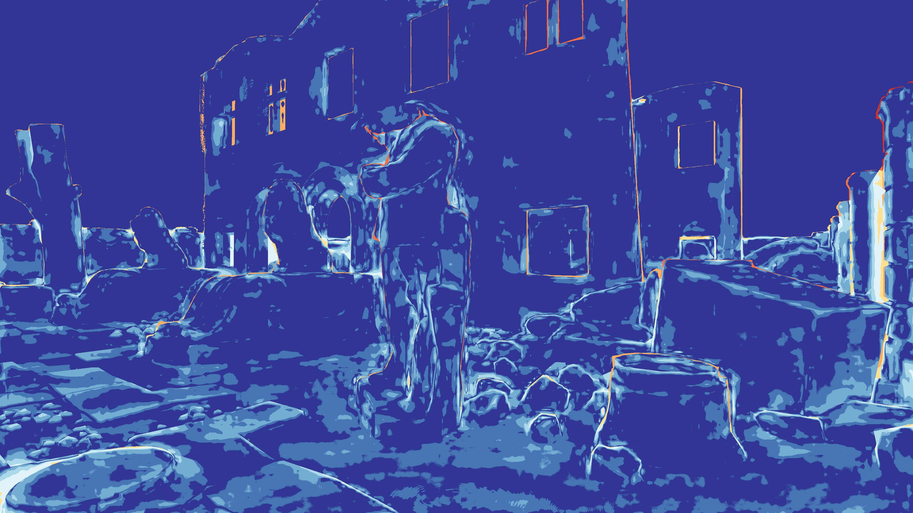
</p>
<p float="left">
  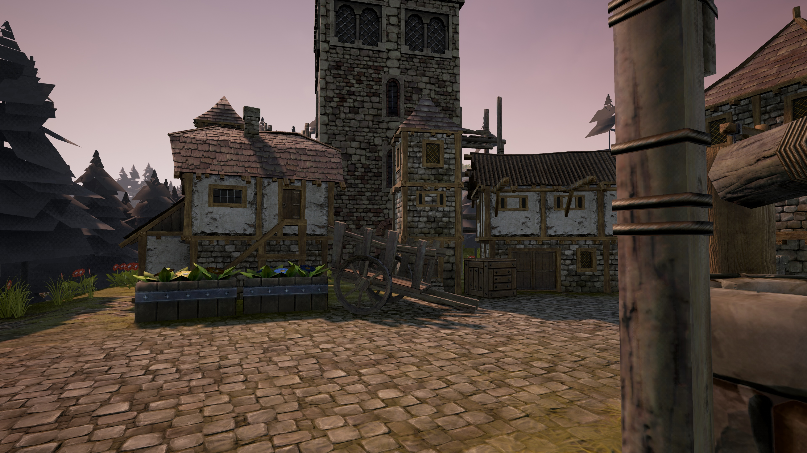
  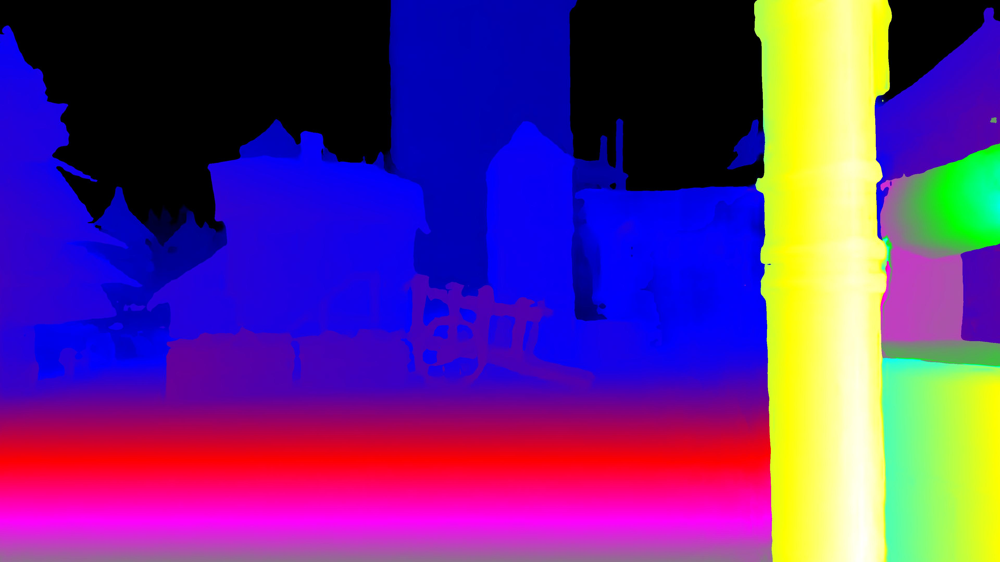 
  
</p>
<p float="left">
  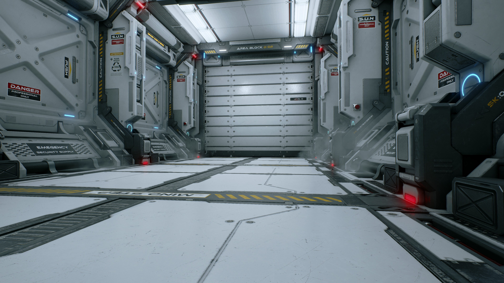
  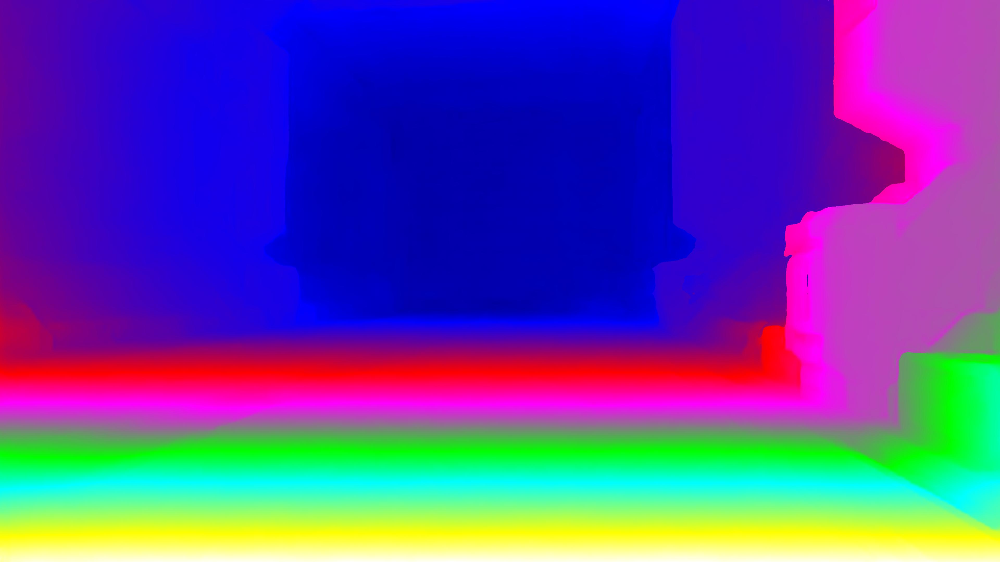 
  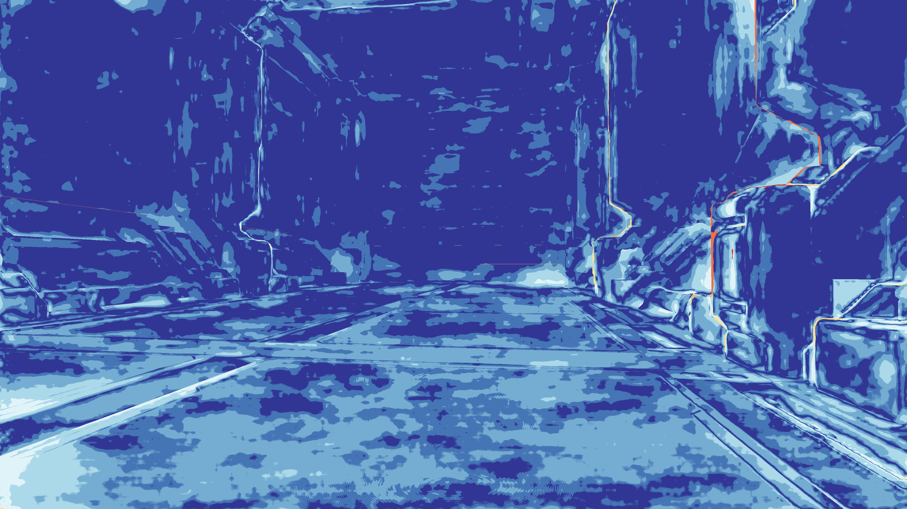
</p> 

**Point Cloud Visualization.** Below, instead, we show point cloud visualizations on UnrealStereo4K for both the passive binocular stereo and the active depth datasets, adopting HSMNet as backbone. From left to right, the reference image, the results obtained using a standard disparity regression (i.e., disparity point estimate), a unimodal Laplacian distribution and our bimodal Laplacian mixture distribution. Note that our bimodal representation  notably  alleviates  bleeding  artifacts near object boundaries compared to both disparity regression and the unimodal formulation.

<p float="left">
  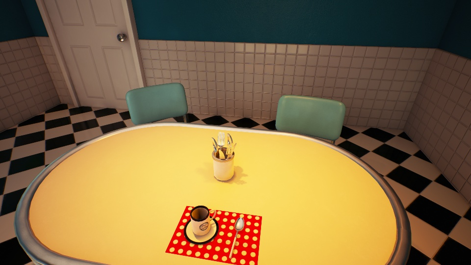
  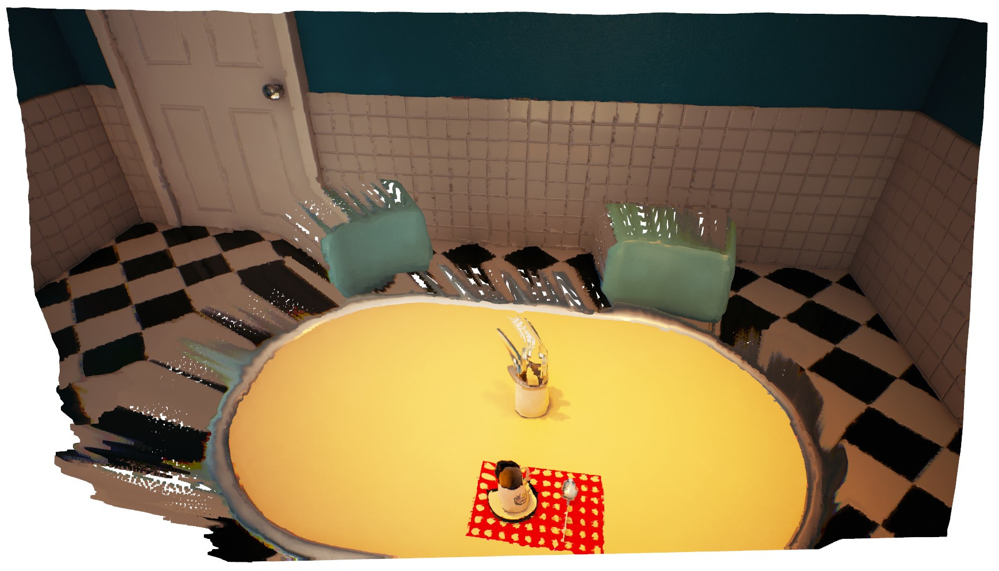
  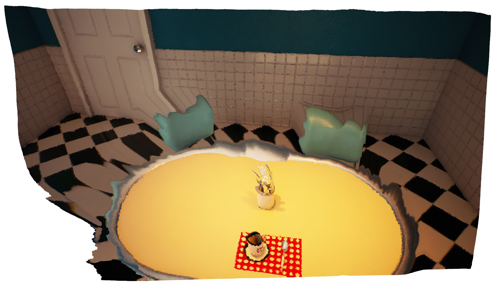 
  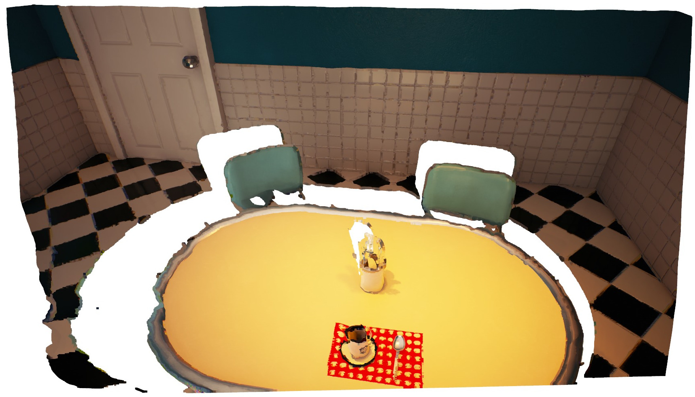
</p>

<p float="left">
  
  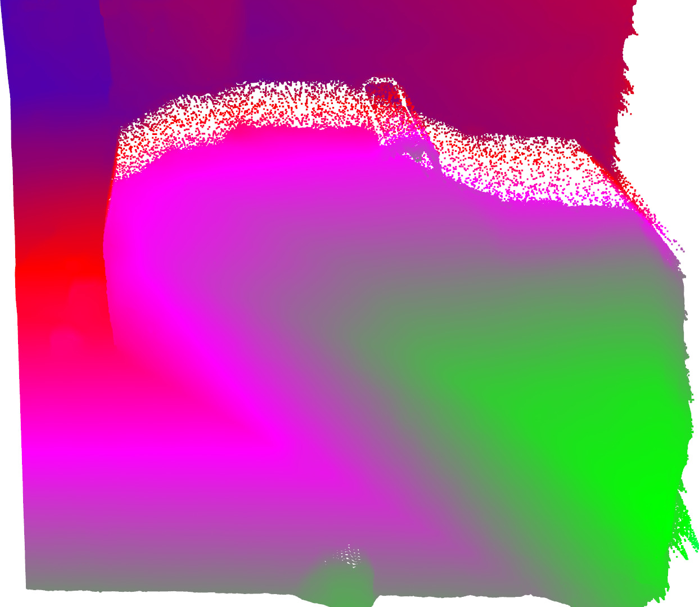
  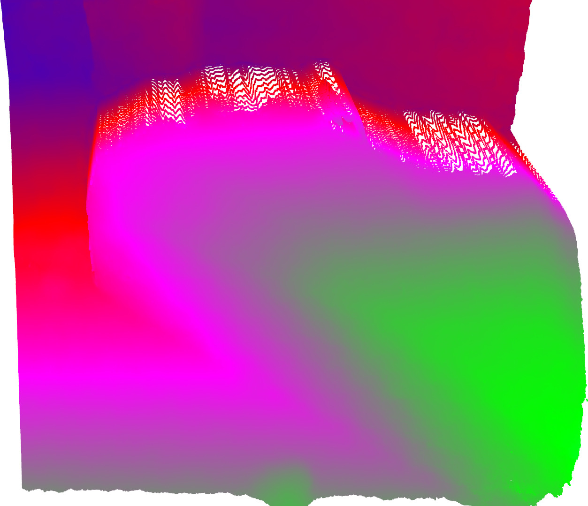 
  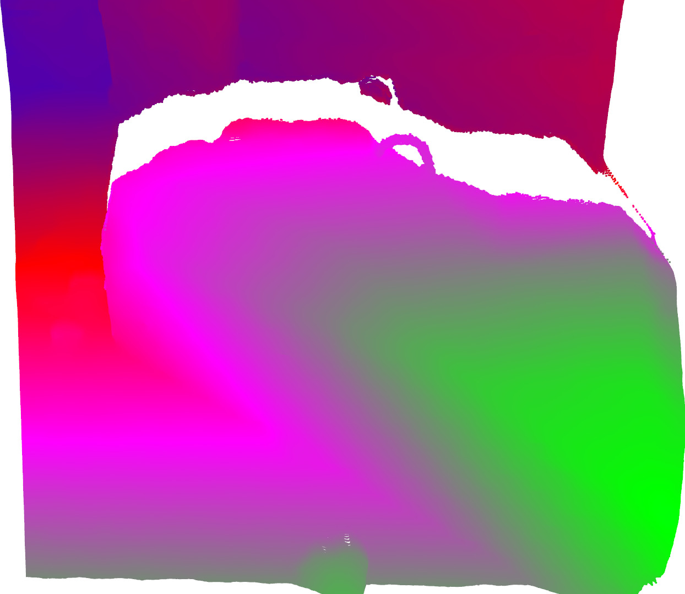
</p>

## Contacts

For questions, please send an email to fabio.tosi5@unibo.it

## Acknowledgements

We thank the authors that shared the code of their works. In particular:

* Jia-Ren Chang for providing the code of [PSMNet](https://github.com/JiaRenChang/PSMNet).
* Gengshan Yang for providing the code of [HSMNet](https://github.com/gengshan-y/high-res-stereo).
* Clement Godard for providing the code of [Monodepth](https://github.com/mrharicot/monodepth) (extended to Stereodepth).
* Shunsuke Saito for providing the code of [PIFu](https://github.com/shunsukesaito/PIFu)

